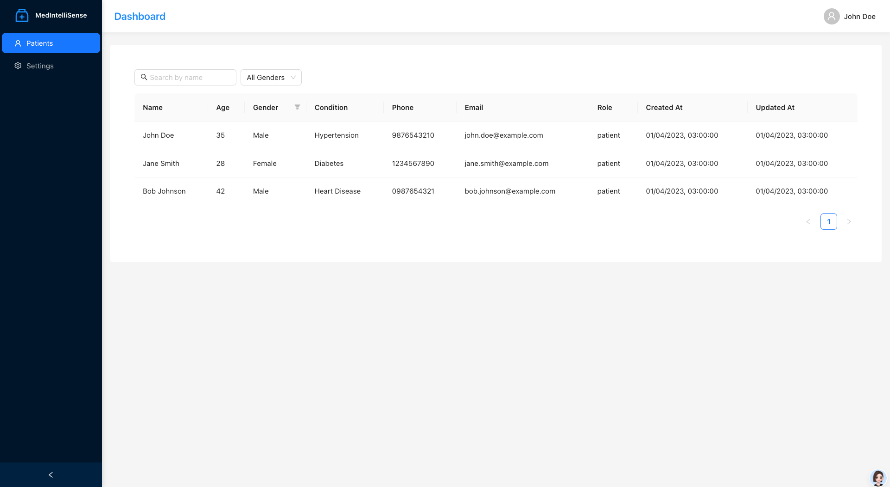

# Med IntelliSense

(This is a template repository of the original project)

Let me take you into the world of healthcare, where a persistent challenge looms over doctors and medical professionals—the chaos of fragmented patient records. Picture a busy clinic or hospital, where doctors often find themselves sifting through information scattered across various systems. It’s not just inconvenient; it complicates consultations. 

Imagine this: a doctor, eager to provide the best care possible, spends a staggering 37% of their day poring over medical records, while nurses dedicate about 22% of their time to the same task. This was highlighted in a 2021 study titled “Interaction Time with Electronic Health Records: A Systematic Review.” These numbers tell a compelling story of a system that’s not functioning as it should.

At the heart of the issue is the struggle to consolidate records that may span many years. The need to summarize this information for pre-consultation diagnoses, pre-operative assessments, and post-operative care becomes absolutely vital.

Enter Med IntelliSense—a game-changer in this narrative. This innovative product is designed specifically to tackle these challenges faced by healthcare professionals every day. With Med IntelliSense, the process of retrieving medical records becomes seamless and straightforward. Using the latest advancements in Large Language Models, our AI doesn’t just sift through data; it synthesizes information into a clear and concise summary of the patient’s history and current condition.



Picture a scenario where a doctor can simply engage with AI, asking it questions about the patient’s background. In seconds, they receive up-to-date and accurate answers—all drawn from comprehensive data. With Med IntelliSense, we aren’t just improving efficiency; we’re empowering healthcare providers to focus on what truly matters: delivering outstanding patient care. This is the future of healthcare, and it’s here now, transforming the way we approach patient records, one consultation at a time.


Technologies Used:
 1. Express.js (Node, NPM)
 2. Next.js with React
 3. PostGreSQL
 4. Minio docker image for file storage
 5. Docker and docker-compose


## Steps to run
1. Pre-requisites to running the project are:
    - Docker
    - Docker Compose
2. Build the baseimgs. These images are ones that provide a foundation. You shouldn't have to build these repeatedly
    ```
    docker-compose -f baseimgs/docker-compose.yml build
    ```
3. Build the container images that will be running. (These will not run if the baseimgs aren't built)
    ```
    docker-compose build
    ```
4. Start all the containers
    ```
    docker-compose up
    ```
5. The project will not be running on `localhost/dashboard`

## Business

